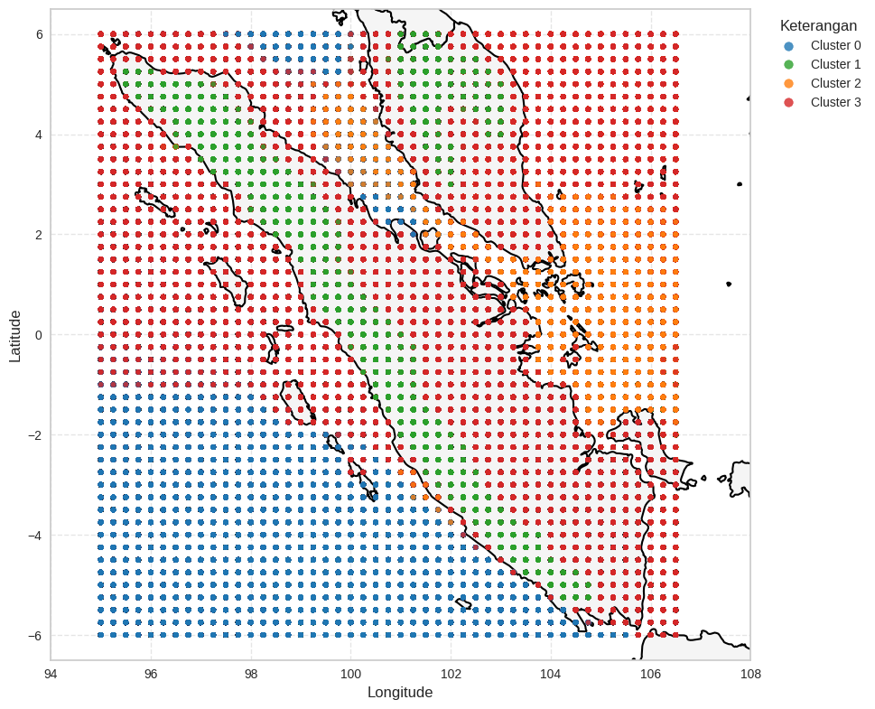

# Penerapan K-Means untuk Klasterisasi Pola Cuaca Spasial di Kawasan Sumatera Berbasis Data Reanalisis ERA5


## 📌 Overview
Repositori ini berisi implementasi kode untuk penelitian mengenai pengelompokan pola cuaca spasial di wilayah Sumatera menggunakan algoritma **Unsupervised Learning K-Means**. Penelitian ini memanfaatkan dataset reanalisis atmosfer **ERA5** yang masif untuk mengidentifikasi zona iklim mikro berdasarkan variabel meteorologis primer.

Penelitian ini telah dipublikasikan di **JUKTISI (Jurnal Komputer Teknologi Informasi Sistem Komputer)**, Vol. 5 No. 1, Juni 2026.

## 📊 Dataset & Scope
* **Sumber Data**: Copernicus Climate Change Service (C3S) - ERA5 hourly data on single levels.
* **Volume Data**: 1.547.616 baris observasi.
* **Variabel**: Suhu udara (t2m), Tekanan permukaan (sp), Angin zonal (u10), dan Angin meridional (v10).
* **Wilayah**: Kawasan Sumatera ($6^{\circ}$ LU - $6^{\circ}$ LS dan $95^{\circ}$ BT - $106,5^{\circ}$ BT).

## ⚙️ Methodology
Proses pemodelan dilakukan secara sistematis melalui tahapan berikut:
1. **Preprocessing**: Validasi *missing values* dan konversi satuan variabel.
2. **Feature Scaling**: Menggunakan **Z-score Standardization (StandardScaler)** untuk menyeimbangkan kontribusi fitur dengan skala kontras (misal: tekanan vs kecepatan angin).
3. **Optimasi K**: Penentuan jumlah klaster optimal menggunakan **Elbow Method**.
4. **Clustering**: Eksekusi K-Means dengan parameter $k=4$ yang merepresentasikan empat zona geografis utama.
5. **Evaluasi**: Validasi kohesi dan separasi klaster menggunakan metrik **Silhouette Coefficient**.



## 🚀 Key Findings
Algoritma berhasil mendelineasi wilayah Sumatera menjadi 4 zona iklim mikro yang representatif:
* **Cluster 0**: Zona Samudra Hindia (Karakteristik maritim murni).
* **Cluster 1**: Zona Orografis (Pegunungan Bukit Barisan - Suhu & Tekanan Rendah).
* **Cluster 2**: Zona Dataran Rendah Timur & Selat Malaka.
* **Cluster 3**: Zona Transisi Pesisir Barat (Buffer Zone).

## 📁 Repository Structure
```text
├── data/               # Link download/sampel dataset 
├── Docs                # Gambar Dokumentasi
├── LICENCE             # Library dependencies, Notebook
├── requirements.txt    
└── README.md
```

## 📝 Publication
Artikel dapat Penelitian dapat diakses melalui:
* DOI: https://doi.org/10.62712/juktisi.v5i1.945 
* ResearchGate: [[Penerapan K-Means untuk Klasterisasi...](https://www.researchgate.net/publication/403753922_Penerapan_K-Means_untuk_Klasterisasi_Pola_Cuaca_Spasial_di_Kawasan_Sumatera_Berbasis_Data_Reanalisis_ERA5)]

## 👥 Contributors
* Yehezkiel Haganta Tarigan - Lead Researcher & Developer 
* Sofia Zahra - Corresponding Author & Co-Researcher 
* Christian Nicholas Sinaga - Co-Researcher

#### The source code in this repository is open-source and licensed under the MIT License.
